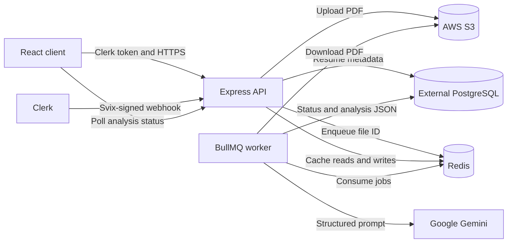

# Resumark

[](https://bun.sh/)
[](https://expressjs.com/)
[](https://react.dev/)
[](https://www.postgresql.org/)
[](https://docs.docker.com/compose/)

Resumark is an authenticated resume-analysis application that stores PDF uploads in AWS S3 and processes them asynchronously with BullMQ and Google Gemini.

## Key Features

Resumark provides Clerk-based authentication, PDF validation and upload, asynchronous analysis, Redis-backed rate limiting and result caching, and a responsive results dashboard. Resume files remain outside the application containers in AWS S3, while PostgreSQL stores ownership, processing state, and structured analysis results.

The analysis report includes candidate information, a summary, extracted skills, strengths, improvement suggestions, overall and ATS scores, formatting feedback, and suggested roles.

## System Architecture



The API and worker run from the same backend container image. Redis is internal to the Compose network and provides both BullMQ transport and short-lived result caching. PostgreSQL, AWS S3, Clerk, and Gemini are external services.

## Repository Structure

```text
resume_analyzer/
|-- backend/
|   |-- prisma/              # Prisma schema, generated client, and migrations
|   |-- src/                 # API, queue, worker, storage, and validation code
|   |-- Dockerfile           # Bun builder and production runtime image
|   `-- README.md            # Backend operations and API documentation
|-- frontend/
|   |-- public/              # Static assets
|   |-- src/                 # React components, pages, services, and styles
|   |-- Dockerfile           # Vite build and unprivileged Nginx runtime
|   |-- nginx.conf           # Single-page application routing
|   `-- README.md            # Frontend development documentation
|-- .dockerignore
|-- docker-compose.yml
`-- README.md
```

## Prerequisites

Local development requires Bun 1.x, PostgreSQL, Redis, an AWS S3 bucket, a Clerk application, and a Google Gemini API key. Docker-based development additionally requires Docker Engine with Docker Compose v2. PostgreSQL is intentionally not included in `docker-compose.yml`.

## Getting Started

### Local Development

Create the backend environment file and replace every placeholder with credentials for your environment:

```bash
cp backend/.env.example backend/.env
```

Install backend dependencies, generate the Prisma client, synchronize the schema, and start the API:

```bash
cd backend
bun install
bunx prisma generate
bun run db:push
bun run dev
```

Start the worker from a second terminal:

```bash
cd backend
bun run src/services/workerService.ts
```

Create `frontend/.env` with the public browser configuration:

```env
VITE_API_URL=http://localhost:5000
VITE_CLERK_PUBLISHABLE_KEY=your_clerk_publishable_key_here
```

Then install and run the frontend:

```bash
cd frontend
bun install
bun run dev
```

The Vite development server is available at `http://localhost:5173`; the API listens on `http://localhost:5000` by default.

### Docker Compose

Create `backend/.env` from the provided example. Compose mounts this file read-only as `/run/secrets/backend-env`; it is not copied into either backend image or expanded into the rendered Compose configuration. The containers override `REDIS_HOST` and `REDIS_PORT` for the internal Redis service. Create a root `.env` file for public Compose interpolation:

```env
VITE_API_URL=http://localhost:5000
VITE_CLERK_PUBLISHABLE_KEY=your_clerk_publishable_key_here
API_PORT=5000
FRONTEND_PORT=3000
NODE_ENV=production
```

Create `frontend/.env` with the same `VITE_*` values. The frontend build reads these from the BuildKit secret mounted during `docker compose build`.

Build and start the stack:

```bash
docker compose up --build -d
```

The frontend is served at `http://localhost:3000`, and the API health endpoint is available at `http://localhost:5000/health`. Redis is not published to the host. Stop the stack with `docker compose down`; add `--volumes` only when the Redis persistence volume should also be removed.

## API Reference

| Method | Route | Authentication | Purpose |
| --- | --- | --- | --- |
| `GET` | `/health` | Public | Check API and PostgreSQL connectivity. |
| `POST` | `/api/resume/upload` | Clerk bearer token | Upload one PDF in the `resume` multipart field. The file is limited to 5 MB. |
| `POST` | `/api/analyze/:id` | Clerk bearer token | Verify ownership and enqueue a BullMQ analysis job. |
| `GET` | `/api/analyze/:id` | Clerk bearer token | Return the current status and analysis result when available. |
| `POST` | `/api/webhooks/clerk` | Svix signature headers | Synchronize Clerk user create, update, and delete events. |

Upload and analysis-trigger routes are Redis rate limited. Protected requests use `Authorization: Bearer <token>`.

## Implementation Notes

The upload path uses Multer memory storage, validates both the PDF MIME type and `.pdf` extension, writes the buffer to S3, and stores a `PENDING` resume record. Re-uploading a file with the same original name for the same user replaces the previous S3 object and clears stale analysis data.

The API enqueues the resume identifier as the BullMQ job ID. The worker changes the record to `PROCESSING`, downloads and parses the PDF, requests structured JSON from Gemini, validates the result with Zod, and stores it in `Resume.analysisResult` before setting the record to `COMPLETED`. Failures set the record to `FAILED`.

Completed and failed results are cached in Redis for five minutes. Worker completion or failure invalidates the corresponding cache entry. Clerk webhooks are verified with Svix before user records are changed.

The production backend image bundles separate API and worker entrypoints and installs production dependencies only. The frontend image contains only Vite's `dist/` output and an unprivileged Nginx runtime. Backend credentials are mounted read-only from `backend/.env` as a Compose secret and loaded when each backend process starts. Vite variables are public build-time browser configuration and must not contain secrets.
